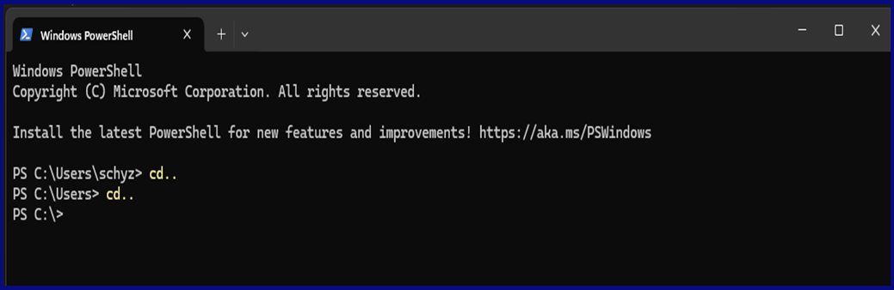

# Hello user and welcome to my Superpy project!

## With this project you can practice managing supermarket products as if it is your own supermarket.


This project is a **Command Line Interface** (CLI) project, which means that you can only use this project in a terminal; for example 'Windows terminal'.

I've written my code in such a way that you only have to follow the steps in a selected option. And if you accidentally typed something wrong, no worries. My code will guide you in how to correct it.

You can copy de codes below and paste them in your terminal as shown below in the screenshot.

Have fun managing with **Superpy**!


<ins>Screenshot of where to paste the code</ins>




* If you want to manage **existing files** which already contain products or if you want to create **new files** to add products, please copy the code below and paste it in your terminal as shown above in the screenshot.

```sh
py .\main.py files
```


* If you want to manage **system dates** or a **special occasion date**, please copy the code below and paste it in your terminal as shown above in the screenshot.

```sh
py .\main.py dates
```


* If you want to manage the **products**, please copy the code below and paste it in your terminal as shown above in the screenshot.
```sh
py .\main.py products
```


* If you want to manage the **calculations** such as **costs**, **losses**, **revenue** or **profit**, please copy the code below and paste it in your terminal as shown above in the screenshot.
```sh
py .\main.py calculations
```
