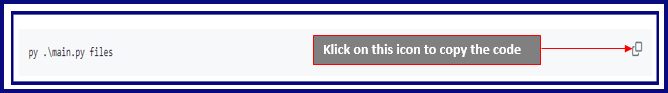

# Hello user and welcome to my 'Superpy' project!

## With this project you can practice managing supermarket products as if it is your own supermarket. And most importantly, this project will also help you on how to avoid wasting products to help making our world a better and durable place.


This project is a **Command Line Interface** (CLI) project, which means that you can only use this project in a terminal; for example 'Windows terminal' / 'Windows PowerShell'.

If you want to use my project, the only things you have to do is:

* Copy one of the codes as shown below in the screenshot
* Paste the code in your terminal as shown below in the screenshot
* Press 'Enter' on your keyboard


After pressing 'Enter' on your keyboard, my code will guide you step by step on all the things you can do with my project. And if you accidentally typed something wrong, no worries. My code will also guide you on how to correct it.

Have fun managing with **Superpy**!


***<ins>Screenshot of how to 'copy' the code</ins>***




***<ins>Screenshot of where to 'paste' the code</ins>***
* ***Note!*** The directory in your terminal will be different than the one shown on the screenshot below, because it depends on from which folder on your device (desktop, laptop, tablet etc.) you will open my project.


If you want to manage **existing files** which already contain products or if you want to create **new files** to add products:
* Copy the code shown below by klicking on this icon also shown below: 
* Paste the code in your terminal as shown above in the screenshot
* Press 'Enter' on your keyboard
* Done!


```sh
py .\main.py files
```


If you want to manage **system dates** or a **special occasion / countdown date**:
* Copy the code shown below by klicking on this icon also shown below: 
* Paste the code in your terminal as shown above in the screenshot
* Press 'Enter' on your keyboard
* Done!

```sh
py .\main.py dates
```


If you want to manage the **products**:
* Copy the code shown below by klicking on this icon also shown below: 
* Paste the code in your terminal as shown above in the screenshot
* Press 'Enter' on your keyboard
* Done!

```sh
py .\main.py products
```


If you want to manage the **calculations** such as **costs**, **losses**, **revenue** or **profit**:
* Copy the code shown below by klicking on this icon also shown below: 
* Paste the code in your terminal as shown above in the screenshot
* Press 'Enter' on your keyboard
* Done!

```sh
py .\main.py calculations
```
